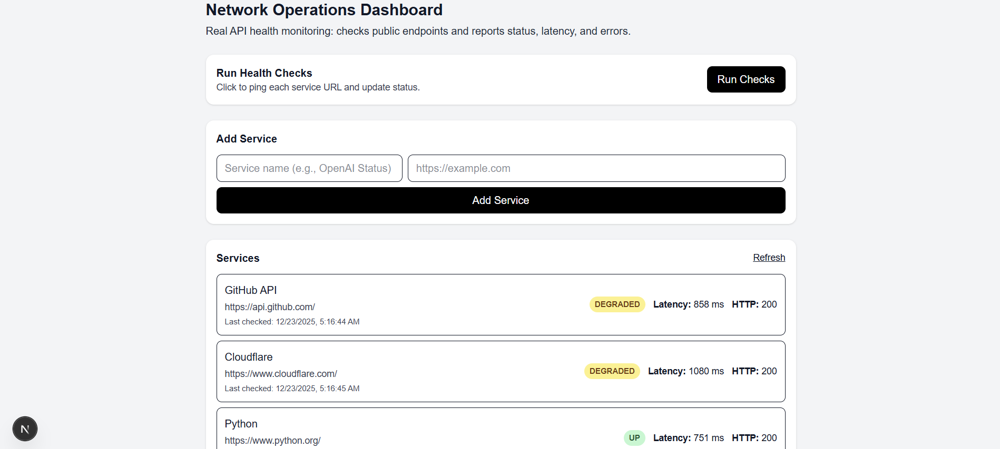
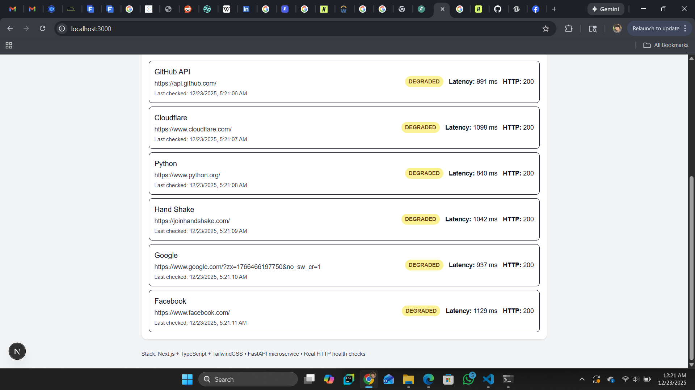
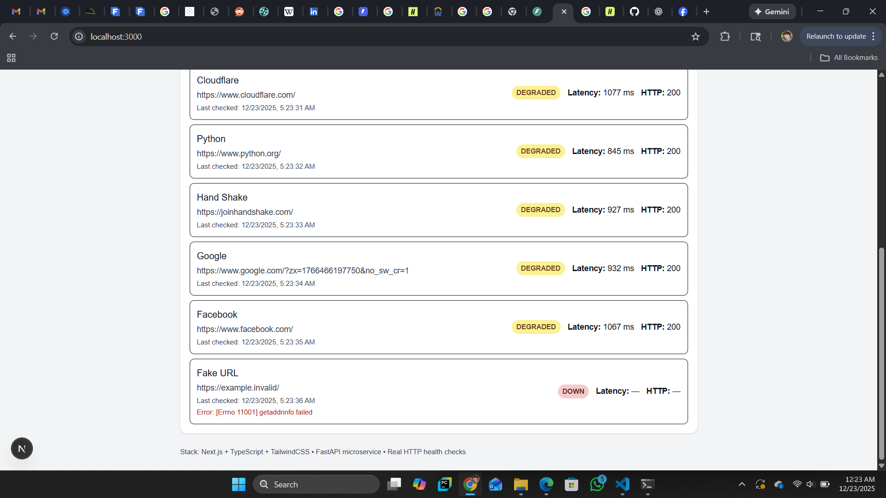
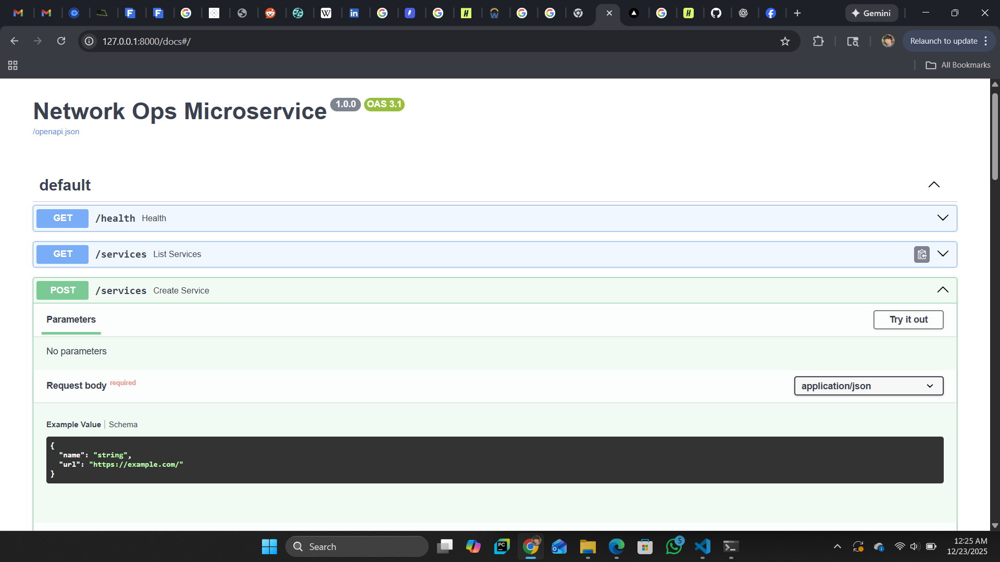

# Network Operations Dashboard (Real API Health Monitor)

A full-stack **Network Operations Dashboard** that performs real HTTP health checks against monitored services and visualizes their operational status in a modern web interface.

This project simulates a lightweight **OSS (Operations Support System)** used by network and platform operations teams to monitor service availability, latency, and failures.

---

## Project Overview

In production environments, operations teams need to quickly answer questions such as:

- Is a service reachable right now?
- Is it slow (degraded) or fully down?
- What HTTP status or error occurred?

This dashboard recreates a simplified version of such a system by combining a Python-based backend microservice with a React-based frontend dashboard.

---

## Features

- Perform real HTTP health checks against public endpoints
- Classify service status as **UP**, **DEGRADED**, or **DOWN**
- Display latency, HTTP status code, last checked time, and error messages
- Add new monitored services dynamically from the UI
- Backend REST API with interactive Swagger documentation
- Clear separation between frontend and backend (microservice-style architecture)

---

## Status Classification Logic

- **UP**: HTTP status 200–399 and latency < 800ms  
- **DEGRADED**: HTTP status 200–399 and latency ≥ 800ms  
- **DOWN**: Request timeout, connection error, or HTTP status ≥ 400  

(Thresholds can be adjusted in the backend.)

---

## System Architecture

- The **frontend** provides the user interface and triggers health checks
- The **backend** acts as a microservice that performs HTTP requests and returns structured results
- Communication occurs via RESTful APIs using JSON

---

## Tech Stack

### Frontend
- Next.js (React)
- TypeScript
- Tailwind CSS

### Backend
- Python
- FastAPI
- Uvicorn
- httpx (HTTP client for health checks)

---

## API Endpoints

- `GET /health` — backend health check
- `GET /services` — retrieve monitored services
- `POST /services` — add a new monitored service
- `POST /services/check` — run health checks for all services

---

## Screenshots

### Dashboard Overview

### Add Service

### Error Handling (DOWN state)

### Backend API Documentation

